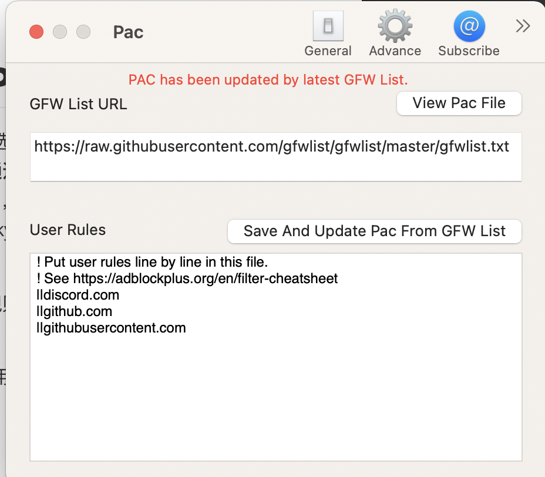

**问题：**在现在的PAC模式下，v2ray会自动选择GFW List里面的网址使用代理。**而我们希望在访问某些网址时走代理，因为通过代理访问这些网站会更加稳定。但是这些网址不被包含在默认PAC列表里。**比如，raw.githubusercontent.com, github官网走代理会更快，又比如zoom, skype, discord等网页app走代理更加稳定。

**解决方法：**我们可以通过添加用户自定义规则来要求访问特定网站时走代理。即User PAC。

**Use PAC使用方法：**打开V2RayU的PAC设置（我使用的是Mac，其他版本也有自定义PAC），页面如此。

然后我们将想要使用代理访问的域名加入其中，**这里域名前`||`的作用就是表示这个域名下所有的url都使用代理，是需要加的。**不然就会在访问子域名时不走代理。

举个例子：

a. https://github.com

b. https://github.com/Tr0py

c. https://raw.github.com/

在这里，`||github.com`包含abc，而GitHub.com只包含a。

掌握这些基本就够了，如果想了解更多的自定义规则请参考https://adblockplus.org/en/filter-cheatsheet。

然后我们点击`Save And Update Pac From GFW List`后断开V2Ray重连一遍再更新一次Pac，就可以了。

这时V2Ray会自动使用代理访问列表中的网址。

**参考资料：**

1. Pac脚本规则：[Adblock Plus filters](https://adblockplus.org/en/filter-cheatsheet)
2. 我的解决方案，在[2.1.0版本Pac自定义规则仍然无效· Issue #465 · yanue/V2rayU](https://github.com/yanue/V2rayU/issues/465)的comment中。

