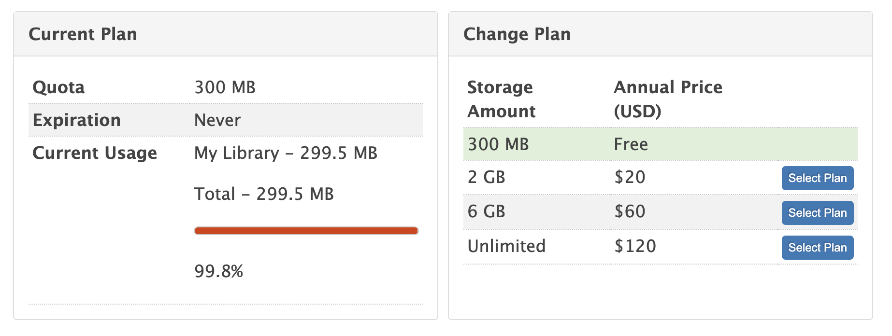
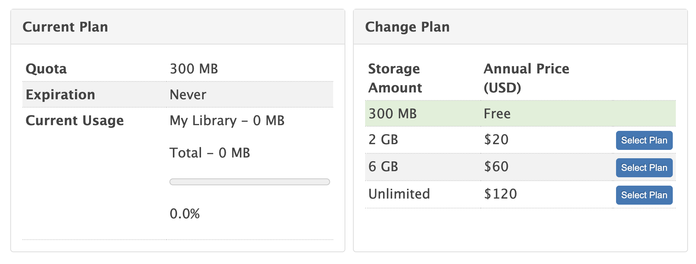

Zotero is a great tool.  But it only has 300MB free cloud storage.  After that,
you have 3 options:

1. Buy [their cloud storage
service](https://www.zotero.org/settings/storage?ref=usbf). (why do I buy yet
another cloud storage after I already have two?)
2. Use [3rd party WebDAV
service](https://www.zotero.org/support/kb/webdav_services). (basically yet
another cloud storage service)
3. **Do it your own**.
	1. Manually sync the whole database.  (dumb)
	2. Sync only attachment files using existing cloud service. (doesn't require
WebDAV support!)

||
|:--:|
|Figure 1: Zotero storage is used up|

### Solution

Idea: Let Zotero sync your metadata and sync your own file attachment data using your
cloud service.

**Implementation**

The `storage` folder inside Zotero data directory contains your attachment
files.

So just use a symbolic link to link the stroage to your cloud service location.

```bash
# backup your current storage folder **after closing Zotero**
mv ~/Zotero/storage ~/Zotero/storage.bak
# copy it to your cloud storage
cp -r ~/Zotero/storage.bak /Users/<username>/Library/CloudStorage/OneDrive/Zotero/sync/storage
# Example symbolic link to my OneDrive folder
ln -s /Users/<username>/Library/CloudStorage/OneDrive/Zotero/sync/storage ~/Zotero/storage
```

Done!  Your file is synced by your cloud service provider and you can free up
your Zotero cloud storage now!

||
|:--:|
|Figure 2: Zotero stroage is freed after sync|

### References

* [Zotero Data Syncing, "Alternative Syncing Solutions" Section](https://www.zotero.org/support/sync)
* [The Zotero Data Directory](https://www.zotero.org/support/zotero_data#locating_your_zotero_data)
