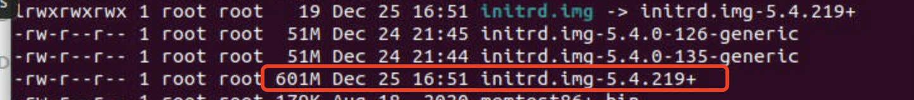

## TL;DR

The `initrd` (initramdisk) is too large to fit into memory during early boot.  Reducing the size helps.

Use `sudo make INSTALL_MOD_STRIP=1` to reduce size of kernel modules in order to reduce the size of initrd.

## Detailed Version

### **Problem: Fail to boot because of OOM error.**

Error message:

```c
Loading Linux 4.19.237
Loading initial ramdisk
error: out of memory
Press any key to continue
```

### **Solution: Reduce the size of initrd**

That’s because the initrd is too huge for early boot. It is directly affected by the size of total kernel modules. So reducing the size of kernel modules would help reducing the size of initrd. One way to do that is by stripping the unnecessary symbols of kernel modules.



```c
sudo make INSTALL_MOD_STRIP=1 modules_install
sudo make install
```

It worked.


### Ref:

- The man who proposed and solve this issue: [](https://unix.stackexchange.com/questions/698890/out-of-memory-on-loading-initial-ramdisk-after-kernel-upgrade-4-15-to-4-19-o)[Out of memory on "Loading initial ramdisk" after kernel upgrade (4.15 to 4.19) on Ubuntu 18 - Unix & Linux Stack Exchange](https://unix.stackexchange.com/questions/698890/out-of-memory-on-loading-initial-ramdisk-after-kernel-upgrade-4-15-to-4-19-o)
- The instructions to strip and rebuild initrd: [](https://unix.stackexchange.com/a/270418/462432)[How to reduce the size of the initrd when compiling your kernel? - Unix & Linux Stack Exchange](https://unix.stackexchange.com/a/270418/462432)

