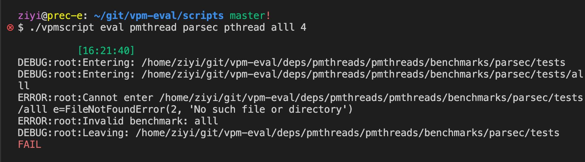
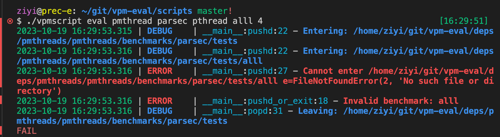

# Python Tip: Use `loguru` for logging

**TL;DR:** Just use `loguru` instead of `logging`.  Save you life.

|  |  |
| --------------------------------------------------------------- | --------------------------------------------------------------- |
| Figure 1. `logging` default format                              | Figure 2. `loguru` default format                               |

**Problem.**  Doing proper logging is important in pyhton scripts, yet the library `logging` has the ugliest possible defaut formatting. (see Figure 1) Configuring `logging` to have a pretty format takes lines of code.

**Solution.** `loguru` has a default config.  (see Figure 2)

**One-liner:**

```python3
from loguru import logger as logging
```

**Example:**

```python3
logging.debug('xxxx')
logging.info('xxxx')
logging.success('xxxx')
logging.warning('xxxx')
logging.error('xxxx')
```
